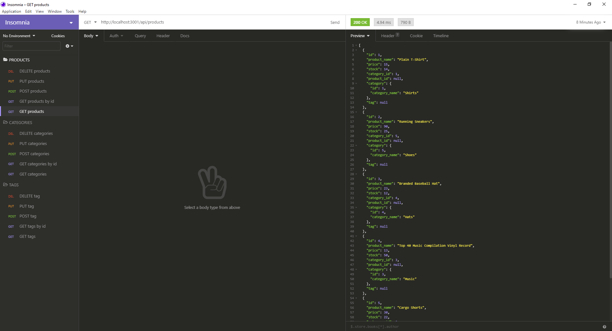

# E-Commerce Backend

## Description

An E-Commerce backend

## Contents
* [Installation](#Installation)
* [Usage](#Usage)
* [Built With](#Built-With)
* [Questions](#Questions)

## Installation

* Download code
* Navigate to root folder in your terminal
* npm install express sequelize mysql2
* Use mysql to initialize the database using the db/schema.sql command
* npm run seed

## Usage

Click here to view demo video: [Demo](https://drive.google.com/file/d/11Se87dkQ2gPv08Uoe5uAJEjhLeZ6HYFb/view?usp=sharing)

- Run "npm start" to start the server
- Use Insomnia Core to test the api endpoints

## Built With

- JavaScript
- Node.js
- MySQL2
- Sequelize
- Inquirer

## Questions

Created by: [kenneththelarson](https://github.com/kenneththelarson)

For further questions please contact [kenneththelarson@gmail.com](mailto:kenneththelarson@gmail.com)